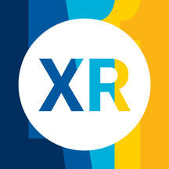

# Lab11 XR

An iOS environment to display & test new [WebXR](https://www.w3.org/TR/webxr) content  

</td></tr></table>

## WebXR Apps

A number of example WebXR apps are included in [`www/examples/`](www/examples) ([preview](https://lab11.github.io/webxr-apps/www))

#### Lab11 Apps:

- [`www/examples/paint`](www/examples/paint) : Control LIFX bulbs by selecting a color & pointing the camera at the lights
- [`www/examples/snap`](www/examples/snap) : Snap a picture of devices & select from device-specific actions to perform

## Build & Run

Assuming [requirements](#requirements) are satisfied, prepare within the main directory:

    cordova prepare

To run on iOS device:

    cordova run --device --developmentTeam=<TEAM_ID>

Alternatively, use `cordova build`, open `platforms/ios/Lab11 XR.xcodeproj`, & run from XCode

## Requirements

- [Node.js](https://nodejs.org)
- [Cordova](https://cordova.apache.org/)
- [XCode on Mac](https://developer.apple.com/xcode/)
- [Apple Developer Account](https://developer.apple.com/)
- iOS 12.0+ Device

## Credits

- [tzachari/cordova-plugin-webxr](https://github.com/tzachari/cordova-plugin-webxr) : The iOS app uses this plugin to create the WebXR-compatible environment
- [mozilla-mobile/webxr-ios](https://github.com/mozilla-mobile/webxr-ios) : The plugin & examples are based on work from this WebXR project by Mozilla
